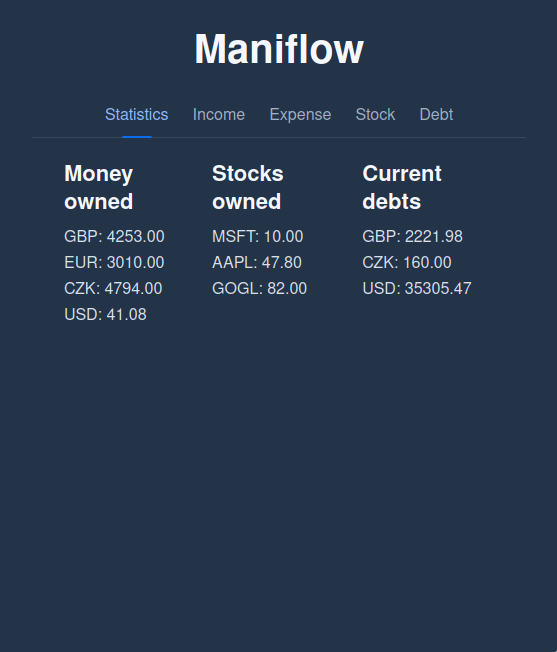
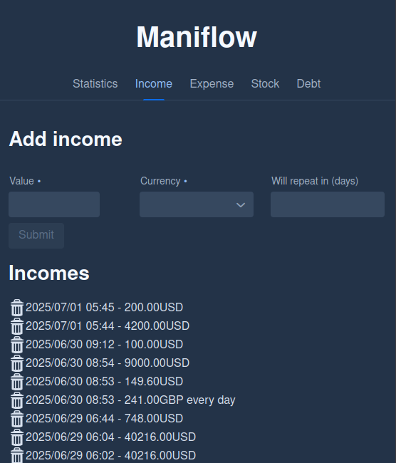
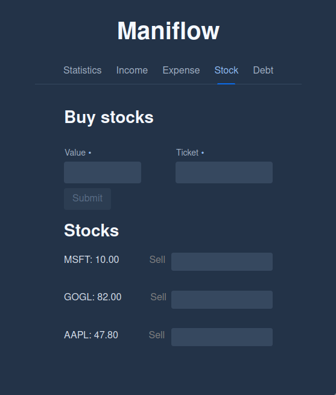
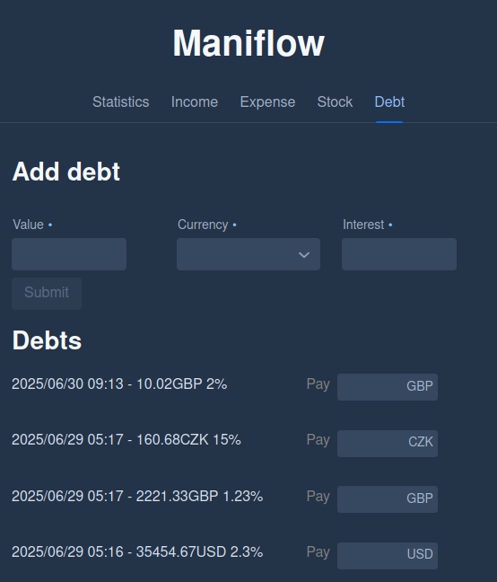

# Maniflow


**Maniflow** is a personal financial management application that helps you track debts, incomes, expenses, and your stock portfolio — all from a unified interface (GUI or CLI).


## 🚀 Features
- Track income, expenses, and debts
- Manage a personal stock portfolio (Polygon API integration)
- GUI and CLI support
- Statistics and summary reports

## 🧰 Built With
- Java
- Spring Boot
- Vaadin
- MongoDB
- Polygon.io API
- Maven

## 📷 Screenshots
<p align="center">
  
  
</p>
<p align="center">
  
  
</p>

## 🛠️ Prerequisites
- Java 22+
- Docker & Docker Compose
- Internet access

## 📦 Installation
Clone the repository: `git clone https://github.com/TrueBubo/Maniflow`  
Go to the project directory: `cd Maniflow`  
Enter your Polygon API key in `api.properties`: `vim api.properties`  
Start the MongoDB database: `sudo docker-compose up -d`  
Build the app: `./mvnw clean package -Pproduction`

## ▶️ Running the App
Example arguments for the application can be found below  
`java -jar target/Maniflow.jar <Application arguments>`

### Example usage
#### GUI Mode
```shell
java -jar target/Maniflow.jar --gui
```
The app will by default start at [localhost:8080](http://localhost:8080)

#### CLI Mode
```shell
java -jar target/Maniflow.jar --add-income 2000 --currency USD
java -jar target/Maniflow.jar --buy-stock AAPL-1.3
java -jar target/Maniflow.jar --stats
```

To see the all the commands available you can run  
```shell
java -jar target/Maniflow.jar --help
```

## 📚 Documentation
You can view documentation [here](https://truebubo.github.io/Maniflow/)  
To generate locally run:  
```shell
./mvnw javadoc:javadoc
```